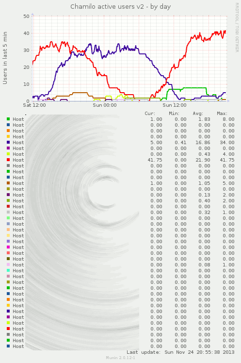

# Munin scripts for Chamilo 1.9.x #

This repository contains a few interesting scripts for Chamilo administrators
who use [Munin](https://github.com/munin-monitoring/munin "Munin on Github") want to be informed about what's going on in their Chamilo portals.
Feel free to download, extend, and contribute back by forking this repository and sending pull requests!

Ideally, once working, the Munin chart will look something like this (here with more than 20 portals on the same server).

# Licensing #

These scripts are available under the GNU/AGPL license. Check the LICENSE file
for details.
Between other things, it is expected for you to contribute any modification or derived work from these scripts you made for yourself, to anyone able to access the resulting charts and kindly asking you to provide the code for the modifications. This is to ensure a snowball effect whereby you save some time downloading these scripts, and in return make others save time by sharing your own work.

# Installation #

To install, please follow the few steps below...

## Prerequisites ##

To run the following scripts, you will need:
* a working munin-node installation
* the PHP CLI (Command Line Interface) interpreter installed (check that just by launching "php -m" from the command line - if it gives you a list of modules, you're good to go)
* Chamilo 1.9.x folders (should work with version 1.10 as well, but not guaranteed) located in /var/www/[something]/www/
* to be logged in as administrator (root) or issue all commands with the "sudo" prefix. This is because most of the commands below are actually administration commands, so most of them require administrator privileges

If your configuration doesn't put the Chamilo folders in /var/www/[something]/www/, at this stage, you will have to hack the "&#95;munin.php" scripts below to make sure the $bd and $sub variables (around line 50) are configured correctly.

## Store this folder somewhere ##

You can store this folder on your server, pretty much anywhere you like as long
as this doesn't prevent Munin from reaching them.
We find that storing them in your home directory or in /usr/local/share is
usually a good place.
Let's say, for the sake of this example, that you store them in the 
/usr/local/share folder, under /usr/local/share/chamilo-munin/.

## Cron ##

Because sometimes your servers might be overloaded, and because some of the
queries in the munin plugins might take more than a second to generate an
answer, we found that using a cron task to generate the results, then checking 
them out with the munin plugin is usually the best strategy. This is why we
created the "&#95;proxy.php" scripts.

The scripts that end with "&#95;munin.php" are the scripts that do the real 
work, and store the results in /tmp/, while the "&#95;munin&#95;proxy.php" 
scripts just fetch the files written to /tmp/ and give them to the Munin server.
This results, for us, in much better (more reliable) charting of graphs. Feel
free to update the scripts if that doesn't suit you. They're usually quite easy
to setup, so that shouldn't be a problem.

To set your cron up, create (as root) the /etc/cron.d/chamilo-munin file and add
the following inside it (we need to execute each script every 5 minutes to give
valuable data to Munin, and we want to do that a little bit before the rounded
5 minutes to ensure the data is ready when Munin fetches it):

    3,8,13,18,23,28,33,38,43,48,53,58 * * * *	root /usr/local/share/chamilo-munin/get_connected_users_munin.php config
    3,8,13,18,23,28,33,38,43,48,53,58 * * * *	root /usr/local/share/chamilo-munin/get_connected_users_munin.php
    3,8,13,18,23,28,33,38,43,48,53,58 * * * *	root /usr/local/share/chamilo-munin/get_registered_courses_munin.php config
    3,8,13,18,23,28,33,38,43,48,53,58 * * * *	root /usr/local/share/chamilo-munin/get_registered_courses_munin.php
    3,8,13,18,23,28,33,38,43,48,53,58 * * * *	root /usr/local/share/chamilo-munin/get_registered_users_munin.php config
    3,8,13,18,23,28,33,38,43,48,53,58 * * * *	root /usr/local/share/chamilo-munin/get_registered_users_munin.php
    3,8,13,18,23,28,33,38,43,48,53,58 * * * *	root /usr/local/share/chamilo-munin/get_registered_sessions_munin.php config
    3,8,13,18,23,28,33,38,43,48,53,58 * * * *	root /usr/local/share/chamilo-munin/get_registered_sessions_munin.php
    3,8,13,18,23,28,33,38,43,48,53,58 * * * *	root /usr/local/share/chamilo-munin/get_live_answers_munin.php config
    3,8,13,18,23,28,33,38,43,48,53,58 * * * *	root /usr/local/share/chamilo-munin/get_live_answers_munin.php
    3,8,13,18,23,28,33,38,43,48,53,58 * * * *	root /usr/local/share/chamilo-munin/get_live_exam_users_munin.php config
    3,8,13,18,23,28,33,38,43,48,53,58 * * * *	root /usr/local/share/chamilo-munin/get_live_exam_users_munin.php

Each time, we also call the "config" part of the plugin. Although this is not 
something that changes very often, it just writes an "almost-static" 1-10KB file
to /tmp/, and it shouldn't take too long to process. Feel free to change the
periodicity of these files to 1 day, if you like. This being said, Munin needs
this file to be there, so make sure you don't clean your /tmp/ directory and
then regenerate those files only the next day or so, as your charts would be 
empty during that time.

It shouldn't be unnecessary to execute those scripts as root. Feel free to 
update that if you are sure of what users can access whatever folder you put
your Munin scripts in.

While you are configuring the rest, below, these scripts are likely to already 
be run once, but if you want to make sure they can, just execute the scripts
in PHP from the command line:

    $ cd /usr/local/share/chamilo-munin/
    $ php get_registered_users_munin.php config
    $ php get_registered_users_munin.php

This should create the corresponding files in your /tmp/ folder, so issuing the
following:

    $ cat /tmp/get_registered_users_config
    $ cat /tmp/get_registered_users

...should give you some data already (greater than 0 if your Chamilo portals
are already running).

## Symlinks ##

Munin (at least in well-organized distributions) works by symlinking (symbolic 
linking) Munin scripts into a specific folder. This allows you to have a lot of
Munin scripts on your system but only enable those which are the most important.
For example, on Debian, active scripts will be linked from /etc/munin/plugins.

You only need to link the &#95;munin&#95;proxy.php scripts, as these are the 
ones that recover the information for you (the non-proxy ones will generate 
that info based on the cron process).

    $ cd /etc/munin/plugins/
    $ ln -s /usr/local/share/chamilo-munin/get_connected_users_munin_proxy.php chamilo-connected-users
    $ ln -s /usr/local/share/chamilo-munin/get_live_answers_munin_proxy.php chamilo-live-answers
    $ ln -s /usr/local/share/chamilo-munin/get_live_exam_users_munin_proxy.php chamilo-live-exam-users
    $ ln -s /usr/local/share/chamilo-munin/get_registered_courses_munin_proxy.php chamilo-registered-courses
    $ ln -s /usr/local/share/chamilo-munin/get_registered_users_munin_proxy.php chamilo-registered-users
    $ ln -s /usr/local/share/chamilo-munin/get_registered_sessions_munin_proxy.php chamilo-registered-sessions

As you can see, we gave slightly different names to the links than the scripts
themselves, just to ensure the scripts are called with a "chamilo" prefix and
are more easily identified in the logs.

## Checking your setup ##

If you have configured everything correctly, you should now be able to issue a munin-run command and get results:

    $ munin-run chamilo-connected-users
    portal/portal1.chamilo.org.value 15
    portal/portal2.chamilo.org.value 214
    portal/portal3.chamilo.org.value 28

If you got this, then it is likely all your scripts will start drawing charts in the next 5-10 minutes. Well done!

## Contact info ##

If you have any question, please use the "Issues" section.
If you are looking for professional services to extend those scripts or set them up for you, please contact the authors at info@beeznest.com (or @beeznest on Twitter) including "Munin" in the topic.
